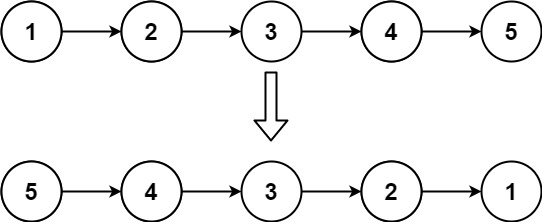
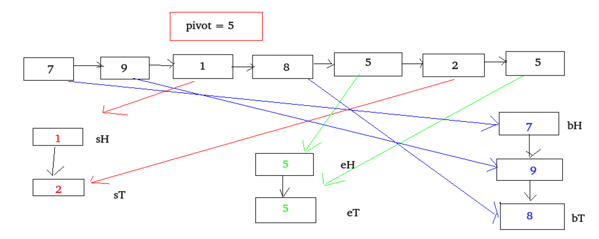

+ [author](https://github.com/3293172751)
<a href="https://github.com/3293172751" target="_blank"></a></p>

# 第10节 单链表数据结构

+ [回到目录](../README.md)
+ [回到项目首页](../../README.md)
+ [上一节](9.md)
> ❤️💕💕算法学习笔记和LeetCode的刷题笔记与记录。Myblog:[http://nsddd.top](http://nsddd.top/)
---
[TOC]

## 单链表的结点结构

```
Class Node(v) {
	V value;
	Node next;
}
```

**由以上结点依次连接起来的所形成的链叫做单链表结构**


## 双链表的结点结构

```
Class Node(v) {
	V value;
	Node next;
	node last;
}
```

**由以上结点依次连接起来的所形成的链叫做双链表结构**

> 单链表和双链表都只需要给一个头部结点head，就可以找到剩下的所有结点


## 基础题

### 单向链表和双向链表的反转

+ ### [leetcode206](https://leetcode.com/problems/reverse-linked-list/)

Given the `head` of a singly linked list, reverse the list, and return *the reversed list*.

**Example 1:**



```
Input: head = [1,2,3,4,5]
Output: [5,4,3,2,1]
```

**Example 2:**


```
Input: head = [1,2]
Output: [2,1]
```

**Example 3:**

```
Input: head = []
Output: []
```

#### 解题

> 关于这道题，我们可以考虑将数据放在栈里面，用到栈的先进后出的原则依次弹出


##### Go语言

```go
/**
 * Definition for singly-linked list.
 * type ListNode struct {
 *     Val int
 *     Next *ListNode
 * }
 */
func reverseList(head *ListNode) *ListNode {
    var prev *ListNode  //定义一个链表
    curr := head
    for curr != nil {
        next := curr.Next
        curr.Next = prev   //改变链表
        prev = curr  //
        curr = next
    }
    return prev
}
```

##### python

```python
# Definition for singly-linked list.
# class ListNode:
#     def __init__(self, val=0, next=None):
#         self.val = val
#         self.next = next
class Solution:
    def reverseList(self, head: Optional[ListNode]) -> Optional[ListNode]:
        pre, cur = None, head
        while cur:
            tmp = cur.next   #保存当前结点
            cur.next = pre
            pre = cur
            cur = tmp    #当前结点是之前保存的结点  后移一位
        return pre   #返回的是前一个结点        
    
```

##### java

```java
/**
 * Definition for singly-linked list.
 * public class ListNode {
 *     int val;
 *     ListNode next;
 *     ListNode() {}
 *     ListNode(int val) { this.val = val; }
 *     ListNode(int val, ListNode next) { this.val = val; this.next = next; }
 * }
 */
class Solution {
    public ListNode reverseList(ListNode head) {
    ListNode pre = null;
    ListNode cur = head;
    while(cur != null){
        ListNode tmp = cur.next;    //保存下一个结点
        cur.next = pre;    //指向前一个结点
        pre = cur;    //保存后续的结点
        cur = tmp;   //当前结点是之前保存的哪个结点
        }
    return pre;
    }
}
```

##### C++

```Cpp
/**
 * Definition for singly-linked list.
 * struct ListNode {
 *     int val;
 *     ListNode *next;
 *     ListNode() : val(0), next(nullptr) {}
 *     ListNode(int x) : val(x), next(nullptr) {}
 *     ListNode(int x, ListNode *next) : val(x), next(next) {}
 * };
 */
class Solution {
public:
    ListNode* reverseList(ListNode* head) {
    ListNode* pre = nullptr;
    ListNode* cur = head;
    while(cur != nullptr){
        ListNode* tmp = cur->next;    //保存下一个结点
        cur->next = pre;    //指向前一个结点
        pre = cur;    //保存后续的结点
        cur = tmp;   //当前结点是之前保存的哪个结点
        }
    return pre;
    }        
};
```


##### c语言

```c
/**
 * Definition for singly-linked list.
 * struct ListNode {
 *     int val;
 *     struct ListNode *next;
 * };
 */


struct ListNode* reverseList(struct ListNode* head){
    struct ListNode* pre = NULL;
    struct ListNode* cur = head;
    while(cur != NULL)
    {
        struct ListNode* tmp = cur->next;    //保存下一个结点
        cur->next = pre;    //指向前一个结点
        pre = cur;    //保存后续的结点
        cur = tmp;   //当前结点是之前保存的哪个结点
        }
    return pre;
}
```

##### JavaScript

```javascript
/**
 * Definition for singly-linked list.
 * function ListNode(val, next) {
 *     this.val = (val===undefined ? 0 : val)
 *     this.next = (next===undefined ? null : next)
 * }
 */
/**
 * @param {ListNode} head
 * @return {ListNode}
 */
var reverseList = function(head) {
    var prev = null  //定义一个链表
    var curr = head
    while(curr) {
        const next = curr.next;
        curr.next = prev;   //改变链表
        prev = curr;  
        curr = next;
    }
    return prev;
};
```


### 打印两个有序链表的公共部分

```

```


## 进阶题

### 面试时链表解题的方法论

+ 对于笔试，不用太在乎空间复杂度，一切为了时间复杂度
+ 对于面试，时间复杂度依然放在第一位，但是一定要找到空间最省的方法

**重要技巧**

1. 额外数据结构记录（哈希表等）
2. 快慢指针


### 判断一个链表是否为回文结构

+ [leetcode](https://leetcode.cn/problems/aMhZSa/)

给定一个链表的 头节点 head ，请判断其是否为回文链表。

如果一个链表是回文，那么链表节点序列从前往后看和从后往前看是相同的。

**示例 1：**


```
输入: head = [1,2,3,3,2,1]
输出: true
```

**示例 2：**


```
输入: head = [1,2]
输出: false
```


#### 解题

**笔试方法**

> 1. 笔试中我们可以考虑**放在栈中**，先进后出（可以**只放一半**的数据进去）
> 2. 设置**快慢指针**，都从`0`下标开始，快指针一次两步，慢指针一次一步，快指针走完的时候慢指针开始放入链表（判断奇偶性）。

```java
/**
 * Definition for singly-linked list.
 * public class ListNode {
 *     int val;
 *     ListNode next;
 *     ListNode() {}
 *     ListNode(int val) { this.val = val; }
 *     ListNode(int val, ListNode next) { this.val = val; this.next = next; }
 * }
 */
class Solution {
    public boolean isPalindrome(ListNode head) {
        Stack<ListNode> stack = new Stack<ListNode>();   //准备一个栈
            ListNode cur = head;
            while(cur != null) {
                //如果结点不为空，就全部压入栈
                stack.push(cur);
                cur = cur.next;
            }
            while(head != null) {
                //头结点不为空
                if(head.val != stack.pop().val) {
                    return false;
                }
                head = head.next;
            }
            return true;
    }
}
```

**面试方法**

> 1. 面试中我们使用改链表的方式（前面一半的数据不变，后面一半的数据反过来 – 反转链表），改完后我们再把链表调回来.

```java
/**
 * Definition for singly-linked list.
 * public class ListNode {
 *     int val;
 *     ListNode next;
 *     ListNode() {}
 *     ListNode(int val) { this.val = val; }
 *     ListNode(int val, ListNode next) { this.val = val; this.next = next; }
 * }
 */
class Solution {
    public boolean isPalindrome(ListNode head) {
        if(head == null || head.next == null) {
            return true;
        }
        ListNode n1 = head;
        ListNode n2 = head;
        //设置快慢指针开始都指向的是头结点head
        while(n2.next != null && n2.next.next != null) {    
            //快慢指针下一节点不为空,继续走
            n1 = n1.next;
            n2 = n2.next.next;
        }
        //快指针走到头了就没有价值了，可以记录慢指针的位置
        n2 = n1.next;
        n1.next = null;
        ListNode n3 = null;
        while(n2 != null) {
            //n2不断地向前走
            n3 = n2.next;    //n3指向下一个结点
            n2.next = n1;
            n1 = n2;   //n1 move 
            n2 = n3;   //n2 move
        }
        n3 = n1;
        n2 = head;
        boolean res = true;
        while(n1 != null && n2 != null) {
            if(n1.val != n2.val) {
                //左右不相等说明了不是回文
                res = false;
                break;
            }
            n1 = n1.next;
            n2 = n2.next;
        }
        //返回之前不要忘记把右部分逆序回来
        n1 = n3.next;
        n3.next = null;
        while(n1 != null) {
            n2 = n1.next;
            n1.next = n3;
            n3 = n1;
            n1 = n2;
        }
        return res;
    }
}
```


### 单链表划分左小右大中间相等形式

- 普通方法，将链表节点放到数组然后partition
- 进阶方法，将链表划分成三个子链表，然后合并

#### 普通方法

普通方法，将链表节点放到数组然后partition
这个方法比较简单，直接将链表中的值保存到一个数组中，然后按照荷兰国旗的划分方式，将数组划分成左边小于那个数，中间等于那个数，右边大于那个数的形式，(荷兰国旗问题用于快速排序中的partition过程)；

划分完之后，再把数组中的值用链表的形式连接起来。　但是这个方法需要额外的O(n)的空间复杂度，而且partition不能达到稳定性(就是会改变原来的相对顺序)；

```java
static class Node {
    public int value;
    public Node next;

    public Node(int value) {
        this.value = value;
    }
}

//普通的需要额外空间O(n)且不能达到稳定性的　方法
static Node partitionList_1(Node head, int pivot) { //pivot表示　枢轴；中心点；旋转运动
    if (head == null) return null;
    Node cur = head;
    int len = 0;
    while (cur != null) {
        len++;
        cur = cur.next;
    }
    Node[] nodeArr = new Node[len];
    cur = head;
    for (int i = 0; i < nodeArr.length; i++) {
        nodeArr[i] = cur;
        cur = cur.next;
    }
    arrPartition(nodeArr, pivot);
    for (int i = 1; i < nodeArr.length; i++) {
        nodeArr[i - 1].next = nodeArr[i];
    }
    nodeArr[nodeArr.length - 1].next = null;  //一定要记得把最后一个指针指向null
    return nodeArr[0];
}

//数组划分的paration
static void arrPartition(Node[] nodeArr, int pivot) {
    int less = -1;
    int more = nodeArr.length;
    int cur = 0;
    while (cur < more) {
        if (nodeArr[cur].value < pivot) {
            swap(nodeArr, ++less, cur++);
        } else if (nodeArr[cur].value > pivot) {
            swap(nodeArr, --more, cur); //注意放到大于区域的时候cur不能++
        } else {
            cur++;
        }
    }
}

//交换两个结点
static void swap(Node[] arrNode, int a, int b) {
    Node temp = arrNode[a];
    arrNode[a] = arrNode[b];
    arrNode[b] = temp;
}
```


#### 进阶方法

进阶方法，将链表划分成三个子链表，然后合并
**这个方法是将原来的链表依次划分成三个链表，三个链表分别为small代表的是左边小于的部分，equal代表的是中间相等的部分，big代表的是右边的大于部分；**
这三个链表都有自己的两个指针Head和Tail分别代表各自的头部和尾部，分成三个子链表之后，我们只需要遍历链表，然后和给定的值比较，按照条件，向三个链表中添加值就可以了，最后把三个链表连接起来就可以了；



```java
//第二种　进阶的方法　不需要额外的空间复杂度，且能达到稳定性
static Node partitionList_2(Node head,int piovt){
    if(head == null)return null;
    Node sH = null,sT = null; //小于部分链表的  head 和tail
    Node eH = null,eT = null; //等于部分链表的　head 和tail
    Node bH = null,bT = null; //大于部分链表的　head 和tail

    Node next = null;  //用来保存下一个结点

    //划分到　三个不同的链表
    while(head != null){
        next = head.next;
        head.next = null; //这个是为了链表拼接后　最后一个就不用再去赋值其next域为null 了
        if(head.value < piovt){  //向　small 部分　分布
            if(sH == null){ //如果是small部分的第一个结点
                sH = head;  //小于区块的头和尾
                sT = head;
            }else {
                sT.next = head; //把head放到small最后一个
                sT = head;  //更新small部分的sT
            }
        }else if(head.value == piovt){   //等于区域
            if(eH == null){
                eH = head;
                eT = head;
            }else{
                eT.next = head;
                eT = head;
            }
        }else {          //大于区域
            if(bH == null){
                bH = head;
                bT = head;
            }else {
                bT.next = head;
                bT = head;
            }
        }
        head = next;
    }

    //将三个链表合并(注意边界的判断)

    if(null != sT) { //合并small和equal部分
        sT.next = eH;
        eT = eT == null ? sT : eT;
    }
    if(null != eT){
        eT.next = bH;
    }

    return sH != null ? sH : eH != null ? eH : bH;
}
```


### 复杂链表的复制

+ [剑指 Offer 35. 复杂链表的复制](https://leetcode.cn/problems/fu-za-lian-biao-de-fu-zhi-lcof/) 

请实现 `copyRandomList` 函数，复制一个复杂链表。在复杂链表中，每个节点除了有一个 `next` 指针指向下一个节点，还有一个 `random` 指针指向链表中的任意节点或者 `null`。

**示例 1：**


```
输入：head = [[7,null],[13,0],[11,4],[10,2],[1,0]]
输出：[[7,null],[13,0],[11,4],[10,2],[1,0]]
```

**示例 2：**


```
输入：head = [[1,1],[2,1]]
输出：[[1,1],[2,1]]
```

**示例 3：**


****

```
输入：head = [[3,null],[3,0],[3,null]]
输出：[[3,null],[3,0],[3,null]]
```

**示例 4：**

```
输入：head = []
输出：[]
解释：给定的链表为空（空指针），因此返回 null。
```

#### 解题

+ 如果是笔试的话，使用额外的空间很好解决，用hash表的方法

```java
/*
// Definition for a Node.
class Node {
    int val;
    Node next;
    Node random;

    public Node(int val) {
        this.val = val;
        this.next = null;
        this.random = null;
    }
}
*/
class Solution {
    public Node copyRandomList(Node head) {
        HashMap<Node,Node> map = new HashMap<Node,Node>();
        //生成哈希表
        Node cur = head;
        while(cur != null) {
            map.put(cur, new Node(cur.val));
            cur = cur.next;
            //做出克隆结点划分到map，每个结点都是如此
        }
        cur = head;
        while(cur != null) {
            // cur 老
            // map.ger(cur) 新
            map.get(cur).next = map.get(cur.next);
            map.get(cur).random = map.get(cur.random);
            cur = cur.next;
        }
        return map.get(head);
    }
}
```


## END 链接

+ [回到目录](../README.md)
+ [上一节](9.md)
+ [下一节](11.md)
---
+ [参与贡献❤️💕💕](https://github.com/3293172751/Block_Chain/blob/master/Git/git-contributor.md)